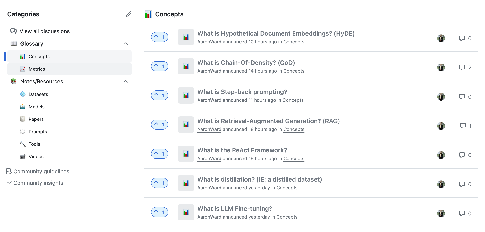

## Generative AI Workbook

This is a central location for all generative AI related work from courses, personal projects, small running examples etc.

### Projects

- `learning`: Folders for learning concepts of different tools and frameworks such as LangChain, Autogen etc. 
- `personal_projects`: location for small once of project to test out features
- `tools`: Location for outputs of ready-made AI tools and models.

#### Blog

- The [Discussion](https://github.com/AaronWard/generative-ai-workbook/discussions) section contains bitesize posts from my learnings about different concepts in the generative AI space. 

  

---

### Usecases of LLMs

- Search
- Classification
- Clustering
- Data, Text and Code generation
- Summarization
- Rewriting
- Extractions
- Proof reading
- Querying Data