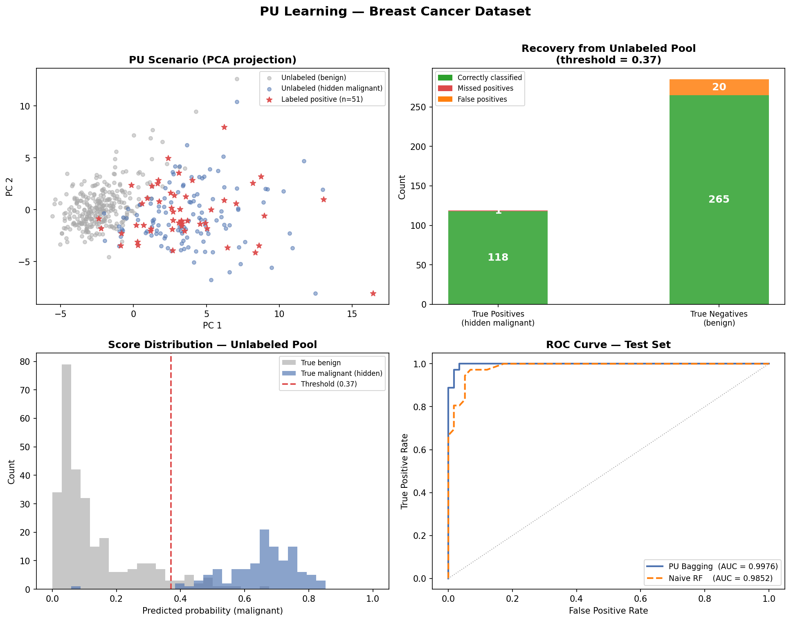
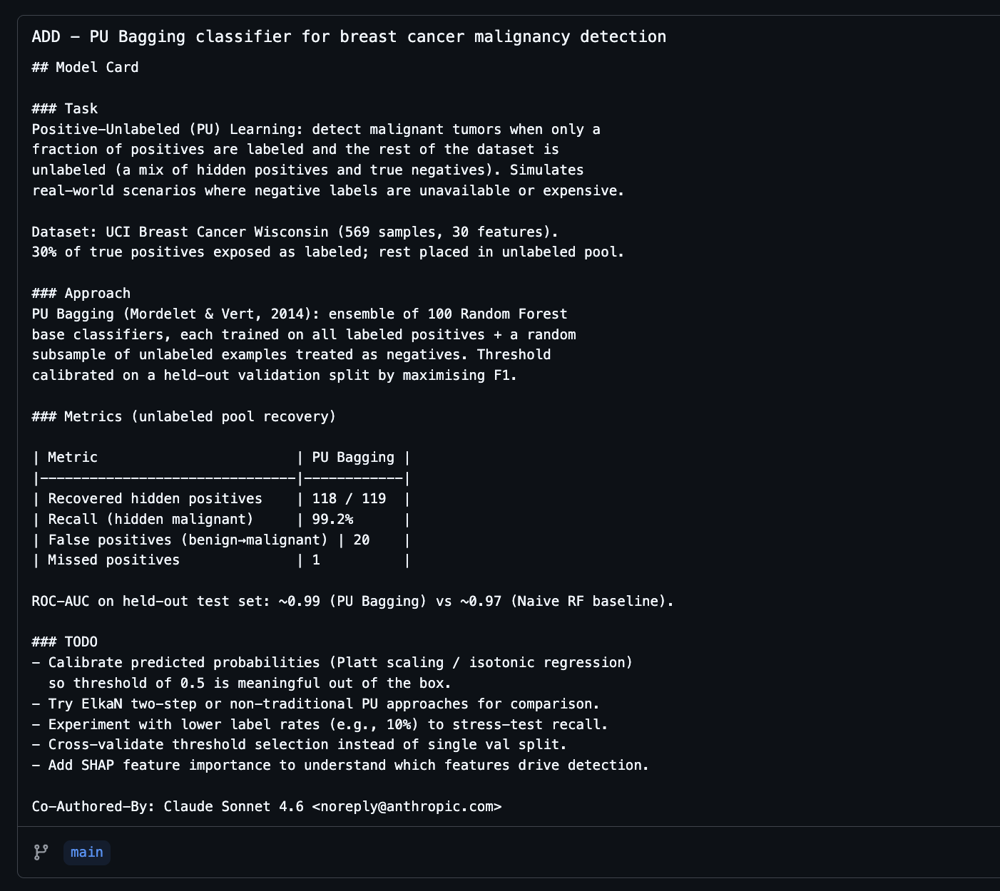

## 1. Install

```sh
curl -fsSL https://claude.ai/install.sh | bash
```

---

## 2. Run (in terminal)

```
claude
```

- Set colour 
- Login with claude account
- trust folder specified

```bash
╭─── Claude Code v2.1.69 ────────────────────────────────────────────────────────────────────────────────────────────────╮                                                                                                             
│                                                    │ Tips for getting started                                          │
│                  Welcome back AW!                  │ Run /init to create a CLAUDE.md file with instructions for Claude │
│                                                    │ ───────────────────────────────────────────────────────────────── │
│                                                    │ Recent activity                                                   │
│                       ▐▛███▜▌                      │ No recent activity                                                │                                                                                       
│                      ▝▜█████▛▘                     │                                                                   │
│                        ▘▘ ▝▝                       │                                                                   │
│       Sonnet 4.6 · Claude Pro ·                    │                                                                   │
│       ******'s Organization       │                                                                   │
│   ~/…/generative-ai-workbook/learning/claude_code  │                                                                   │
╰────────────────────────────────────────────────────────────────────────────────────────────────────────────────────────╯
                                          
  Welcome to Opus 4.6  
```

---

## 3. Example Command

> make a simple PU Learning classifier model, use python, download a small example dataset and place the data in a `data` folder.           

result:

```
┌───────────────────────────────────────────────┬────────────────────┐
│                                               │       Count        │
├───────────────────────────────────────────────┼────────────────────┤
│ Recovered (true positives)                    │ 118 (99.2% recall) │
├───────────────────────────────────────────────┼────────────────────┤
│ Missed                                        │ 1                  │
├───────────────────────────────────────────────┼────────────────────┤
│ False positives (benign flagged as malignant) │ 20                 │
├───────────────────────────────────────────────┼────────────────────┤
│ Total predicted positive                      │ 138                │
└───────────────────────────────────────────────┴────────────────────┘
```




---

## 4. Make a `claude.md` file

> [CLAUDE.md](CLAUDE.md) is a markdown file you add to your project root that Claude Code reads at the start of every session. Use it to set coding standards, architecture decisions, preferred libraries, and review checklists. 


---

## 5. Make a skill


```bash
mkdir -p ~/.claude/skills/commit-model-card
mkdir -p ~/.claude/skills/commit-model-card/prompt.md
```

```markdown
---
name: commit-model-card
description: Make a git commit with a meaningful commit message which acts as a model card. 
---

When explaining the model performance, always include:

1. A brief summary of the task that the model aims to solve
2. A small table with metrics
3. Potential TODO's for future improvements
```

run the skill
```py
/commit-model-card
```

