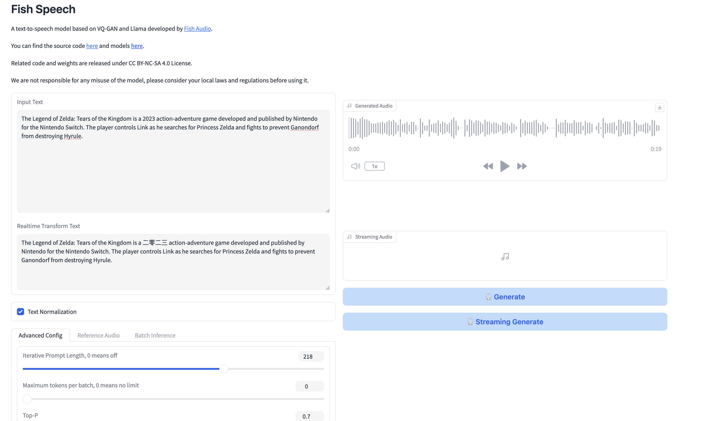

Fish is an open source non-commercial TTS model. It provides a gradio app in which you can generate audio files using a UI. it also provides methods to finetune additional models given some reference audio.

## Docs:

- https://speech.fish.audio/finetune/
- https://github.com/fishaudio/fish-speech


## Setup 


```bash
git clone https://github.com/fishaudio/fish-speech.git
cd fish-speech
```

Make a conda environment

```bash
# Install PyTorch, Hugging Face CLI, and other dependencies
pip install torch torchvision torchaudio --index-url https://download.pytorch.org/whl/cpu
pip install huggingface_hub ipython
```

```bash
huggingface-cli download fishaudio/fish-speech-1.4 --local-dir checkpoints/fish-speech-1.4
```

No CUDA on MacOS - need to pass the CPU flag. It takes roughly 30 seconds on my Macbook.

```bash
python3 tools/webui.py \
    --llama-checkpoint-path checkpoints/fish-speech-1.4 \
    --decoder-checkpoint-path checkpoints/fish-speech-1.4/firefly-gan-vq-fsq-8x1024-21hz-generator.pth
    --device "cpu"
```