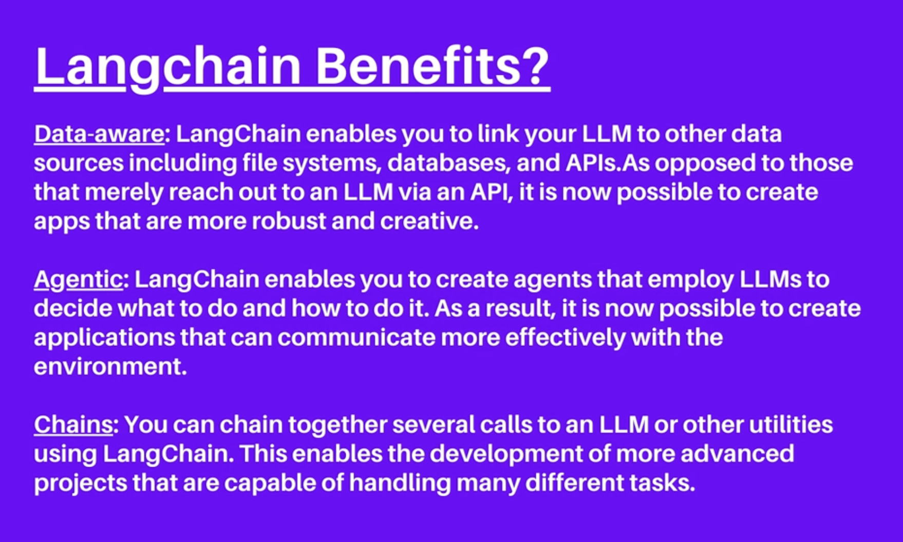
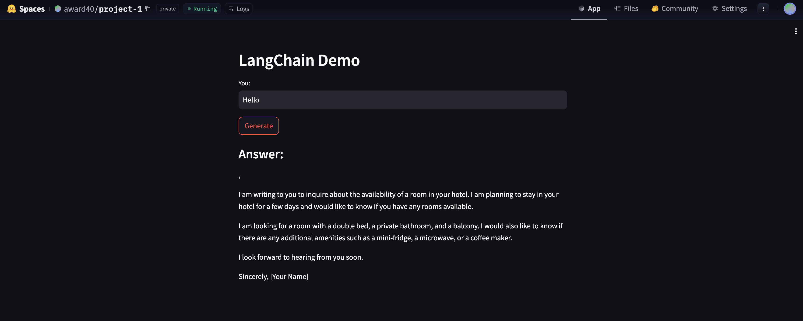

# Notes


### Usecases of LLMs

- Search
- Classification
- Clustering
- Data, Text and Code generation
- Summarization
- Rewriting
- Extractions
- Proof reading
- Querying Data


### Why langchain?

<center>

</center>


### HuggingFace Spaces

Free cloud based containers for LLMs and ML web apps.


```md
> make secrets in settings for OPENAI_API_KEY
> make app.py file 
> make .env-sample file
> make requirements.txt file
```

<center>

</center>


### Lanchain Modules

- Models: 
- Chains:
