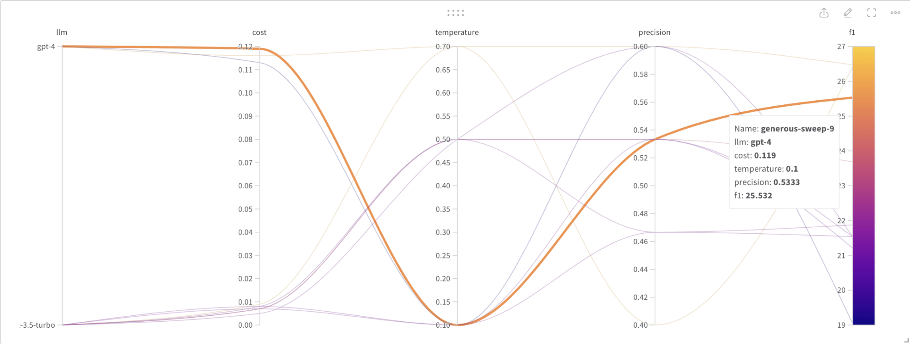
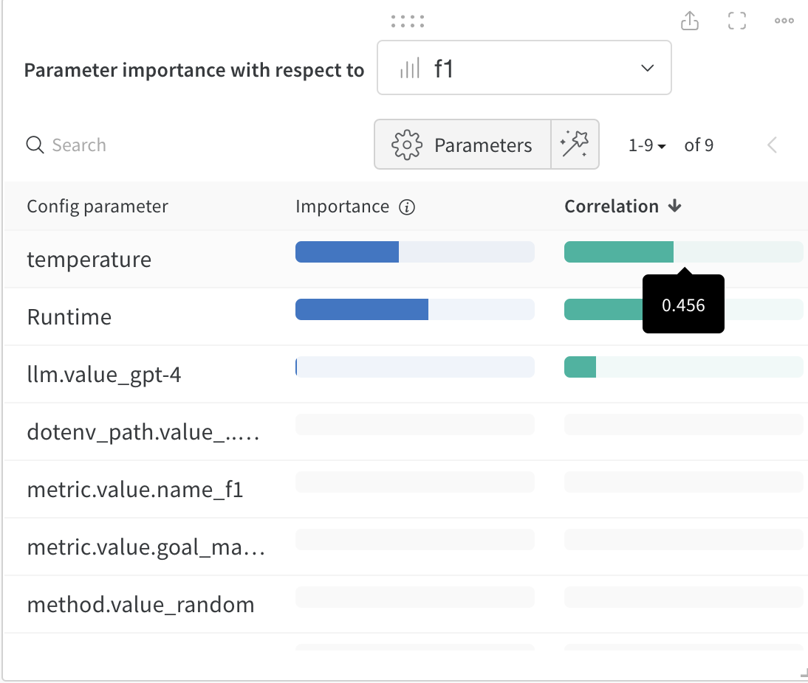

## Evaluating Autogen x Weights & Biases

</img>

See [here](https://github.com/AaronWard/generative-ai-workbook/discussions/36) to read full overview of wandb with autogen

As i've worked more and more with LLMs i've begun to realize i'm sick of "eyeballing" how well the application is performing, its slow and subjective and ends up in paying more for API calls in the long run. I'm putting together an example notebook to showcase how you can evaluate autogen QA Retrieval with weights and biases to find the optimal parameters for a given problem.

**STEPS**:

1. Embedding a document to a vector db (in my example: the autogen paper pdf)
2. Making a QA evaluation dataset from the document using an LLM
3. Running sweeps of experiments using different parameters such as model type, temperature, cost and evaluation metrics
4. Use an LLM to evaluate the response to the questions against the actual answer and calculate the score.

This one is for QA Retrieval, but you can use it for other tasks with different evaluation approaches too. I plan to make a boilerplate so that others can easily drop in their own agent interaction scenarios (two way chat, groupchats etc.). and run sweeps of experiments.

---

The parallel coordinates plot allows you to highlight top performing runs and determine what the optimal parameters were for that experiment run.

</img>

You can also check coorelations between parameters and metric performance

</img>

Additional suggestions:

- [https://github.com/TonicAI/tvalmetrics](https://github.com/TonicAI/tvalmetrics)
> qingyun-wu — 10/31/2023 12:27 AM @AaronWard Your proposed metrics are quite comprehensive. It would be great to add metrics tracking the frequency and hierarchy of function/method calls. Also it would be interesting if you could add some visualization on the inter-agent communication, e.g, the number of conversation turns between different pairs of agents. This could help identify "hotspot" agents where most time is spent, guiding where optimization is most impactful.

> frank.martinez — 10/30/2023 3:13 PM Awesome… additional metrics: a] min context length to receive accurate responses, b] cache or memory settings and how they improve performance, c] error rate

