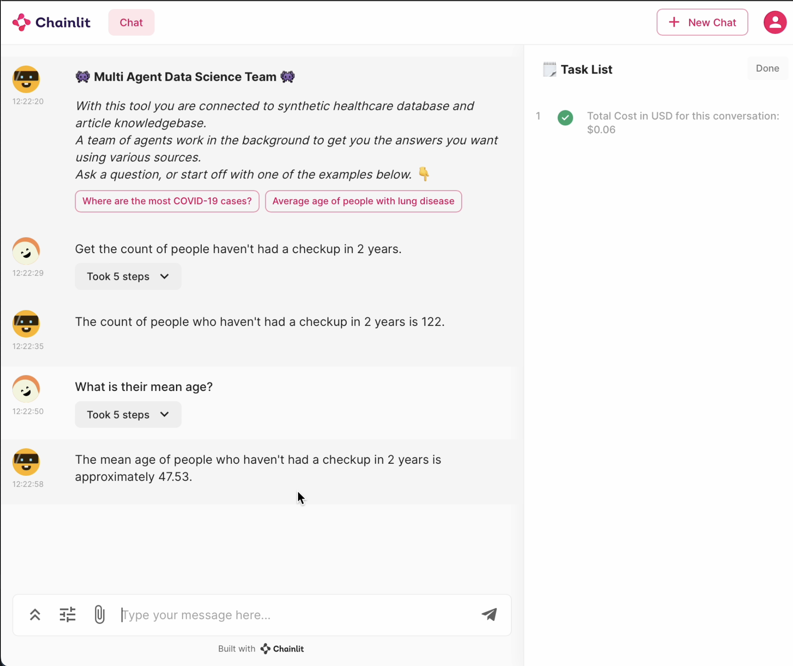

# Autogen x Postgres x Chainlit

The following is a chainlit application that takes in user input, and uses agents to query a postgres database using SQL function calling. 
`AssistantAgent` and `UserProxyAgent` are abstrated in a `AgentBase` class, which handles all the general operations such as setting configurations lists. `DBAgent`, which inherits from `AgentBase`, uses `PostgresMananger` to define functions to be used in function calls (ex: `self.db.run_sql`).


<!-- <video src='./public/img/ui.mov' width=180/> | <video src='./public/img/ui.mov' width=180/> -->

<!-- [](./public/img/uix.mov) -->

<center>
<video width="600" controls>
  <source src="https://user-images.githubusercontent.com/22074246/282296147-7ab64970-0941-4640-a7e7-5ddf5d27f9af.mp4" type="video/mp4">
</video>
</center>


## Data

### Postgres Setup

#### Instantiate a database:
You can copy your own csv data into the db.

```sql
> HOMEBREW_NO_AUTO_UPDATE=1 brew install postgresql 
> brew services start postgresql
> psql -U postgres
> CREATE DATABASE testdb;
> GRANT ALL PRIVILEGES ON DATABASE testdb TO postgres;
> CREATE TABLE patients (                                                        
		    id SERIAL PRIMARY KEY,                                                                 
		    PATIENT_ID VARCHAR(255),
		    STATE VARCHAR(2),
		    FIPS INT,
		    DIAGNOSED_COVID BOOLEAN,
		    DIAGNOSES_DATE DATE,
		    CURRENT_AGE INT,
		    AGE_AT_DIAGNOSIS FLOAT
);	
> \COPY patients FROM 'path/file.csv' DELIMITER ',' CSV HEADER;

```

Put this in your `.env` file: 

```
POSTGRES_CONNECTION_URL=postgresql://<user>:<password>@localhost:5432/<db_name>
```


#### How restart postgres:
```bash
brew services restart postgresql@16
psql -U postgres -d testdb -h localhost -p 5432
/opt/homebrew/opt/postgresql@16/bin/psql -U postgres -d testdb -h localhost -p 5432
/opt/homebrew/opt/postgresql@16/bin/pg_ctl -D /opt/homebrew/var/postgresql@16 start
```

**Fix double instance issue**:
```bash
brew services stop postgresql@15 # stop service
brew services stop postgresql@16
postgres --version

brew tap petere/postgresql
brew install petere/postgresql/postgresql@16

echo 'export PATH="/opt/homebrew/opt/postgresql@16/bin:$PATH"' >> ~/.bash_profile
source ~/.bash_profile

lsof -i :5432 # check instances on this port
pg_ctl -D /opt/homebrew/var/postgres16 start # start server
```
