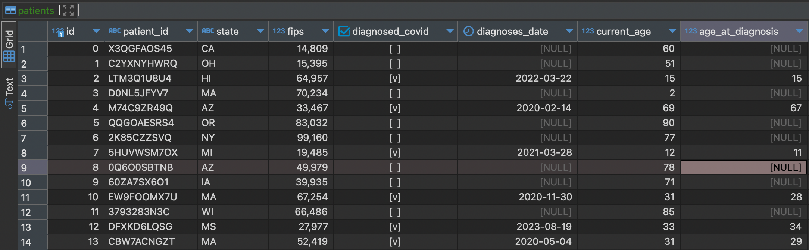
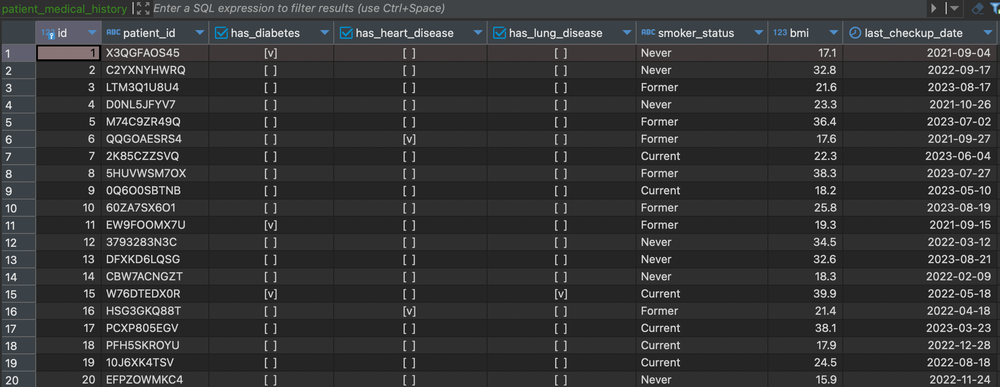

### OpenAI Assistant API

This example is copied largely from this [codebase](https://github.com/disler/multi-agent-postgres-data-analytics/blob/main/postgres_da_ai_agent/turbo_main.py) for using the OpenAI Assistants API. 

This example, similarly to previous examples, uses the a postgres database with synthetic healthcare data:
</img>

</img>
