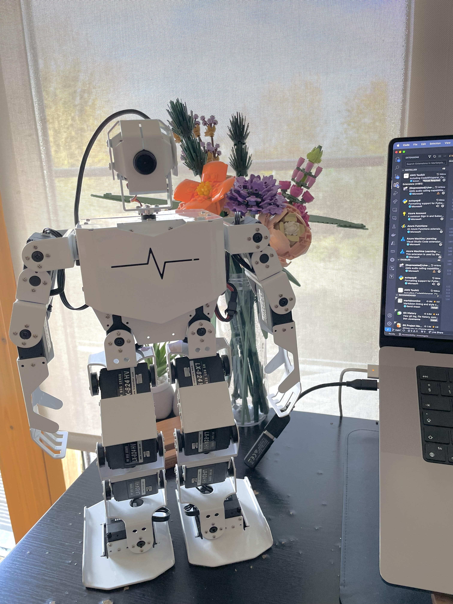

# Autogen Robot

This project showcases how LLM's can be built to control robot actions. Rather than deterministic input rules that dictate how the robot might move - for example pressing forward on the controller to initiate the walking action - the LLM brain of the robot knows what actions it can perform, and decide to put a number of combinations together to achieve a goal.

</img>

The intended goal is to control a robots motions using natural language.
The robot has different sets of motions called Actions (located in `/action_files`).
These can be used as function calls

## Progress updates:

<blockquote class="twitter-tweet" data-media-max-width="560">
Using agents to act as a robots brain 🧠   Using <a href="https://twitter.com/pyautogen?ref_src=twsrc%5Etfw">@pyautogen</a> multi-agent framework for controlling the robots actions and using <a href="https://twitter.com/chainlit_io?ref_src=twsrc%5Etfw">@chainlit_io</a> to interface and suggest actions in natural language.  This is a very early implementation but the end goal is full autonomy <a href="https://t.co/7gmk07MtWS">https://t.co/7gmk07MtWS</a> <a href="https://t.co/Um5oGipz4v">pic.twitter.com/Um5oGipz4v</a>
&mdash; AW (@TrainedOnTest) <a href="https://twitter.com/TrainedOnTest/status/1731411008827064481?ref_src=twsrc%5Etfw">December 3, 2023</a></blockquote> 

**Future modifications to include:**
- Adding voice assisted interaction with the robot.
- Autonomous decision making