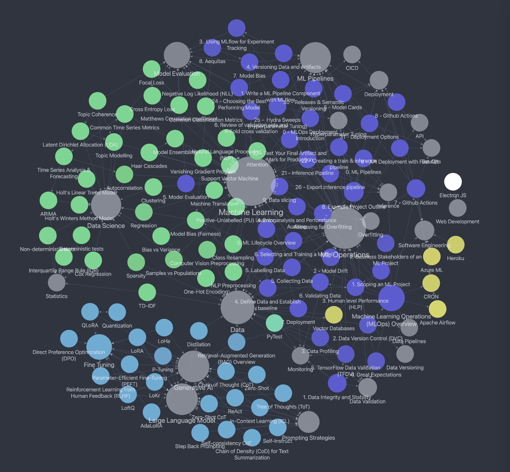

## Obsidian Notes RAG

This project allows you to with your obsidian notes by exposing it as a graph database to retrieve connected documents. For this i will be using my own technical obsidian notes, found here: [https://github.com/AaronWard/obsidian-notes](https://github.com/AaronWard/obsidian-notes)

</img>

</img>
