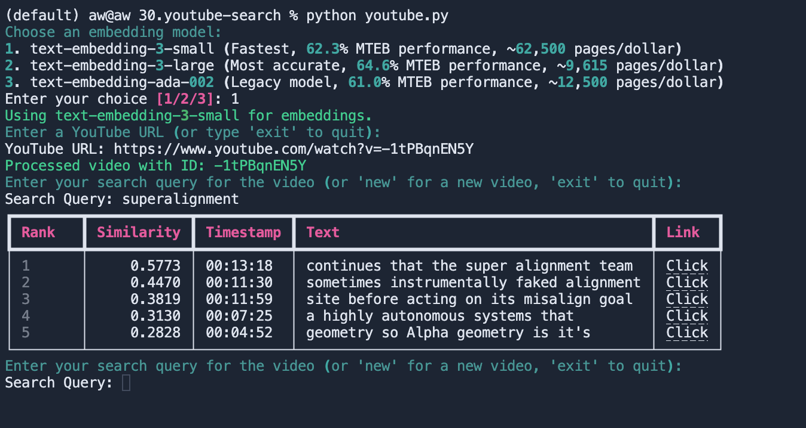

## Youtube Search

This allows you to enter a url for a youtube video, and use similarity search to find the timestamps of when the search query appears. You can click the link to open the video in the browser at the timestamp where the search query was found.

