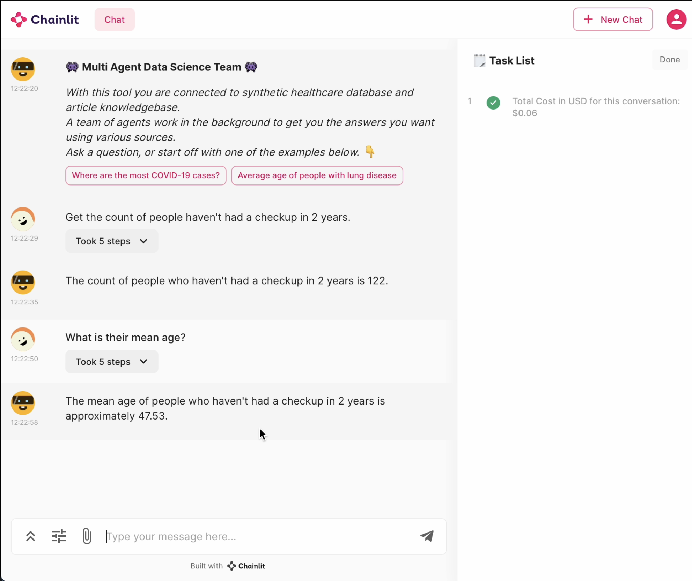
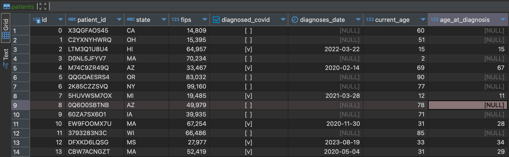

## Personal Projects

Heres a list of project descriptions. Earlier projects are very elementary examples, with more complex use cases further down the list
| | **Project Name** | **Description** | **Technologies Used** | **Notes** | **Image** |
|---|---|---|---|---|---| 
| 1 | **`Annoyed Chatbot`** | A simple example of using a prompt template to influence a chatbot to respond in a sarcastic manner. | langchain |  | - |
| 2 | **`Audio-GPT`** | The audio is then sent to Whisper-1 to transcribe spoken language into text. This text will then be sent to ChatGPT. The response from OpenAI is then converted into a realistic voice via the ElevenLabs API The audio is then played in response to the prompt you said. | ElevenLabs, openai api | - |  |
| 3 | **`President Speeches`** | Retrieval augment generation (RAG) example - Load a large corpus of presidential speeches into a vector store, and use VectorDBQA chain to ask questions about the documents. | langchain |  |  |
| 4 | **`Fact Checker`** | A simple Streamlit application using a langchain sequential chain that answers a question and reassesses if the response is true based on a number of assertions. | streamlit, langchain |  | - |
| 5 | **`Youtube Video QA`** | Download the transcript of a youtube video using the YoutubeLoader, and store the text from the transcript in a FAISS vectorstore. A ChatOpenAI is then used to answer questions about the video. | langchain | Langchain.YoutubeLoader was broken at the time | - |
| 6 | **`Historia-Lingua`** | Interactive LLM powered history application. You decide the year and click location using an interactive map interface, and the LLM provides you history knowledge of what happened in that region around that time period. | Docker, openai api, langchain |  |  |
| 7 | **`Web Scraping Researcher`** | A sample application which uses LLMs search the web based on the users query for a research topic, and summarize the page content. | langchain, fastapi | SERP_API_KEY was expensive | - |
| 8 | **`Echarts-Streamlit`** | Example app to display data in interactive charts - The goal is to have an LLM to autogenerate and return nice looking charts in the UI. | streamlit, Apache ECharts | No models used in this example, just an example template that could be used |  |
| 9 | **`Miniminds`** | A 2D simulation game with NPCs powered by LLM agents. | pygame | Not yet finished, the base UI and randomly generated map is complete, along with a movable avatar and different instances of Person. Need to come back to this some day and add personalities to the NPCs. | <video width="320" height="240" src="https://private-user-images.githubusercontent.com/22074246/282771873-3196290b-669d-4200-b54e-08024f77c677.mov?jwt=eyJhbGciOiJIUzI1NiIsInR5cCI6IkpXVCJ9.eyJpc3MiOiJnaXRodWIuY29tIiwiYXVkIjoicmF3LmdpdGh1YnVzZXJjb250ZW50LmNvbSIsImtleSI6ImtleTUiLCJleHAiOjE3MzQzNTcxOTksIm5iZiI6MTczNDM1Njg5OSwicGF0aCI6Ii8yMjA3NDI0Ni8yODI3NzE4NzMtMzE5NjI5MGItNjY5ZC00MjAwLWI1NGUtMDgwMjRmNzdjNjc3Lm1vdj9YLUFtei1BbGdvcml0aG09QVdTNC1ITUFDLVNIQTI1NiZYLUFtei1DcmVkZW50aWFsPUFLSUFWQ09EWUxTQTUzUFFLNFpBJTJGMjAyNDEyMTYlMkZ1cy1lYXN0LTElMkZzMyUyRmF3czRfcmVxdWVzdCZYLUFtei1EYXRlPTIwMjQxMjE2VDEzNDgxOVomWC1BbXotRXhwaXJlcz0zMDAmWC1BbXotU2lnbmF0dXJlPTY4MzZhNzlmZGFiZTUzZTFlMDFiYzM4MzUwMGQ0N2NiMDkzNGI5MThkZTkxOGI2ZDA5YjYzOGVkZjA0NzQ5ZGYmWC1BbXotU2lnbmVkSGVhZGVycz1ob3N0In0.zFosxaloHaEYQwzkAGT8jtHv59As33WzoPYNhthuf84"></video> |
| 10 | **`Chainlit x Autogen`** | A chat interface to interact with autogen agents | chainlit, autogen | chainlit has changed significantly since this example was made, so the code used might not work with newer versions. The new version of autogen no longer has a logging capability | <video width="320" height="240" src="https://private-user-images.githubusercontent.com/22074246/282296147-7ab64970-0941-4640-a7e7-5ddf5d27f9af.mp4?jwt=eyJhbGciOiJIUzI1NiIsInR5cCI6IkpXVCJ9.eyJpc3MiOiJnaXRodWIuY29tIiwiYXVkIjoicmF3LmdpdGh1YnVzZXJjb250ZW50LmNvbSIsImtleSI6ImtleTUiLCJleHAiOjE3MzQzNTczMzAsIm5iZiI6MTczNDM1NzAzMCwicGF0aCI6Ii8yMjA3NDI0Ni8yODIyOTYxNDctN2FiNjQ5NzAtMDk0MS00NjQwLWE3ZTctNWRkZjVkMjdmOWFmLm1wND9YLUFtei1BbGdvcml0aG09QVdTNC1ITUFDLVNIQTI1NiZYLUFtei1DcmVkZW50aWFsPUFLSUFWQ09EWUxTQTUzUFFLNFpBJTJGMjAyNDEyMTYlMkZ1cy1lYXN0LTElMkZzMyUyRmF3czRfcmVxdWVzdCZYLUFtei1EYXRlPTIwMjQxMjE2VDEzNTAzMFomWC1BbXotRXhwaXJlcz0zMDAmWC1BbXotU2lnbmF0dXJlPWIyN2M4MGZhNmFjMmE5Mjk5YTg2NDczMDBhN2VhZWNkNWY0NTc4NzdhNGM1YzJkZDc4MTVhN2NkYjUzYzgwOTImWC1BbXotU2lnbmVkSGVhZGVycz1ob3N0In0.1ixSx8wcjAnktpsuTly0w9ZnA32vE8NAVRs47xo4kCw"></video> |
| 11 | **`Ollama x Autogen`** | Example of using open source local models agents with Autogen - use case is to calculate the YTD percentage gain of a given stock. | Ollama, Autogen, Litellm | At the time llama2 struggled to write the code to perform this task. | - |
| 12 | **`Cellular Automata with Agents`** | This example shows how agents can be used to generate cellular automata videos - they would write the code to achieve this. Considering this is an iterative task, the agents are instructed to use GPU acceleration to speed things up where possible. | autogen | Reused this notebook to test out CompressionAgent agent, so not a very tidy notebook. |  |
| 13 | **`Autogen RAG QA Evaluation`** | This project showcases how you can evaluate autogen QA Retrieval with weights and biases to find the optimal parameters for a given problem - the iterations are evaluated and plotting using a parallel coordinates plot. For this use case, a QA dataset was generated using langchain and OpenAI. | Autogen, wandb, langchain |  | |
| 14 | **`SQL Database Querying with Agents`** | A multi-agent application that takes in user input, and uses agents generate SQL, query a postgres database and respond with an answer to the user. | chainlit, autogen, postgres | Newer autogen and chainlit versions may affect this application's functionality. |  |
| 15 | **`SQL Database Querying with OpenAI Assistant`** | This project contains two examples multi-agent application that takes in user input, automatically generate SQL, query a postgres database and respond with an answer to the user. One using autogents GPTAssistantAgent and the other using openai's assistant API | chainlit, autogen, postgres, openai API | Newer autogen versions may affect this application's functionality. |  |
| 16 | **`Agent Orchestration using Autogen`** | This extends example 13 to include orchestration of agents. IE: controlling the flow in which messages are sent to specific agents. | chainlit, autogen, postgres | Newer autogen and chainlit versions may affect this application's functionality. | - |
| 17 | **`Dynamic Agents x Autogen`** | The purpose of this project is to create agents dynamically depending on the complexity of the user's input or query. | langchain, autogen | Unfinished | - |
| 18 | **`Visual Agent - for plotting interactive charts`** | This folder contains code for setting up a conversation initialization with agents focused on visual tasks with plotting libraries. | Autogen, chainlit, plotly | Unfinished - streamlit eCharts wouldn't work, Chainlit wasn't finished implementing the plotly at the time. | - |
| 19 | **`Autogen Discord RAG`** | This project involved scraping all the chat log history from the Autogen and store it in a vector store to perform RAG operations using Agents. The purpose of this is to use the knowledge of Autogen users/developers to answer questions on how to use autogen | Autogen, ChromaDB | This is a naive approach, meaning the raw text conversations text were stored in the vector store - this led to issues with the LLM returning some irrelevant information such as conversational "back-and-forths". A better approach would be to further process the data using an LLM to make a QA dataset. | - |
| 20 | **`Autogen Agent Robot`** | This project showcases how LLM's can be built to control robot actions. Rather than deterministic input rules that dictate how the robot might move - for example pressing forward on the controller to initiate the walking action - the LLM brain of the robot knows what actions it can perform, and decide to put a number of combinations together to achieve a goal. The robot is interfaced with natural language in a Chainlit UI. | Physical robot, Raspberry Pi, Autogen, Chainlit | I damaged the expansion board of the robot so the limbs are currently immobile. Will need to fix if i want to extend this project. |  |
| 21 | **`Custom GPT - Autogen Discord RAG`** | This example extends project 18 to create a more refined QA dataset, by iterating over the chat logs and creating question/answer pairs. | OpenAI API, Autogen, ChromaDB | This cost about $10 to do. |  |
| 22 | **`Local Mistral 8x7B Agents`** | Using a quantized mistral-8x7b-instruct-v0.1.Q3_K_M model to create local agents for simple coding tasks, rather than spending money on the OpenAI API. | llamafile, autogen, mistral | Had issues with function calling. Using the instruct model wasn't a good idea - should have used the chat model instead. There is special system message formatting that needs to be used `<s>[INST]` - I suppose now that ollama supports openai schema this shouldn't be an issue going forward. | - |
| 23 | **`Local Agent File Organizer`** | A simple POC for using agents to categorize and organize photographs using the llava-v1.5-7b local vision model. Assume you have a folder with a random mix of image types, the agents will be able to classify what's happening in the image and move it to the appropriate folders. Add-on capabilities: have the agents create new category folders. | autogen, llamafile, chainlit | Unfinished, couldn't get autogen to work with llava-v1.5-7b because llamafile didn't support the OpenAI schema. Also - chainlit no longer supports indent in their sdk so seeing interagent communication in a nice UI is no longer possible -_- |  |
| 24 | **`LLM Finetuning with MLX`** | mlx is an array library that is similar to Numpy, It contains a python API for Apple Silicon. For this i needed some data to fintune a model on - i converted the QA dataset from project 20 into .jsonl format and used mlx to fine a mistral 7B model | mlx | output from the finetuned model was basically nonsense, would probably need to use more data to get good results or using a different model. Finetuning takes some time so it needs to be done overnight. | - |
| 25 | **`Llava x Autogen`** | Using the llava vision model with autogen to answer questions based on images provided to it, using chainlit as the chat user interface. | litellm, ollama, autogen, llava, chainlit | Need to try this again without litellm now that Ollama supports the openai schema |  |
| 26 | **`Vision Scraper`** | The idea of this project is to use LLMs to interact with the browser and control the UI to read the contents given a url by the user. | TaskWeaver, Selenium, OpenAi, Llava, Crew ai, autogen | **On Hold**, *Llava is terrible at OCR tasks* |  |
| 27 | **`Obsidian Graph RAG`** | Speak with your obsidian.md notes | GraphQL, Ollama, Obsidian.md, CrewAI  | - |  |
| 28 | **`Wayback Machine Scraper`** | Analysis of website UI's overtime using vision models  | Selenium, OpenAI, | **Unfinished**, *Wayback machine limits to 15 archival requests and retrievals per minute* |  |
| 29 | **`Txitter Scraper`** | Selenium controlled tweet scraping (no AI component yet) | Selenium, sqlite  | **Unfinished** | - |
| 30 | **`Youtube Word Search`** | Search Youtube transcripts with similarity search | youtube_transcript_api, OpenAI | - |  |
| 31 | **`TrendTube - `** | Track topic trends for youtube video topics over time, by analyzing transcripts | Vue js, youtube_transcript_api, ControlFlow, Chroma, OpenAI | - |  |
| 32 | **`BookReader - `** | Interactive audio book with AI generated audio, video etc | Vue js, Elevenlabs, kokory | *Unfinished, will come back to this* | 
| 33 | **`Digital Sea Monkeys - `** | Autonomous digital sea monkeys within a 3D space | Vue js, three.js, Ollama | *Unfinished, will come back to this* | |